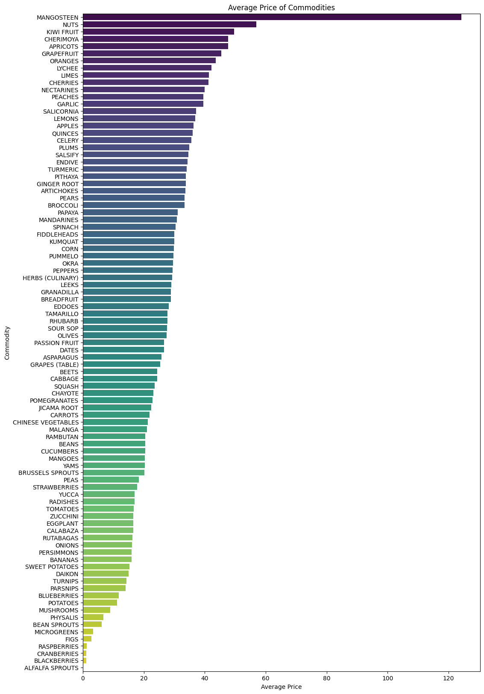
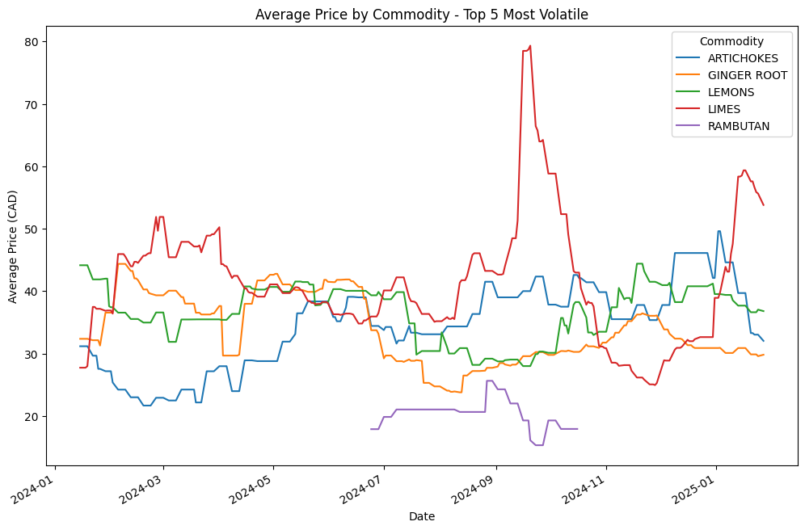
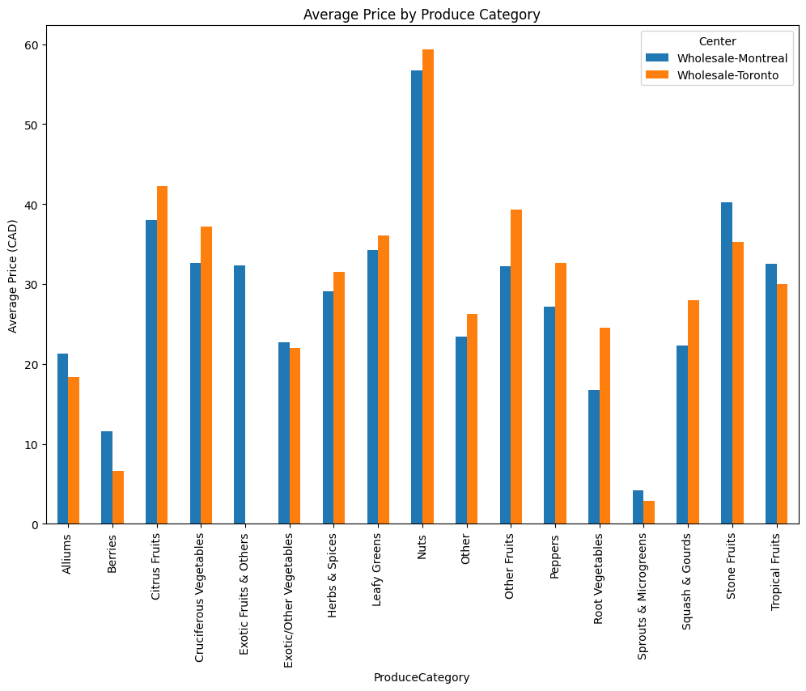

# Exploratory Data Analysis 
## Wholesale Produce Prices in Canada 2024

**CAPSTONE 1 for Osric Dhoubhadel**

---
## Table of Contents

1. [Introduction](#introduction)
2. [Data Source](#data-source)
3. [Data Wrangling](#data-wrangling)
4. [Data Analysis](#data-analysis)
5. [Conclusion](#conclusion)


---
## Introduction

**Motive: Prices of groceries been high lately**

We explore the following:
- How have prices changed for different produce?
- Is there a big discrepancy between the two markets: Toronto and Montreal?
- Which commodities - highest average price &  volatility

---
## Data Description
**Daily Wholesale Prices Report** 
Daily price ranges for horticultural commodities,  based on data from selected wholesalers. 

The prices reflect the wholesalers' asking prices to retailers and include details on commodity types, varieties, origins, and pack sizes.


[Source  https://open.canada.ca/data/en/dataset/920bc8e2-de26-4bf6-ac41-ed47962d0ff6](https://open.canada.ca/data/en/dataset/920bc8e2-de26-4bf6-ac41-ed47962d0ff6)

---
## Data Wrangling: Basics
- Data source is 42.5MB in size
- Data consists of 197585 rows × 23 columns
- Many columns repeated in both English and French
- Row date starts: 2024-01-15, ends: 2025-01-27
- Cities include: Montreal and Toronto

---
- Commodity list includes: (Total number is 111)

```python
[
    'alfalfa sprouts', 'apples', 'apricots', 'artichokes', 'asparagus', 'avocados',
    'bananas', 'bean sprouts', 'beans', 'beets', 'blackberries', 'blueberries',
    'broccoli', 'brussels sprouts', 'cabbage', 'calabaza', 'carrots',
    'cauliflower', 'celery', 'chayote', 'cherimoya', 'cherries',
    'chinese vegetables', 'coconuts', 'collard', 'corn', 'cranberries',
    'cucumbers', 'daikon', 'dandelion', 'dates', 'eddoes', 'eggplant', 'endive',
    'escarole', 'figs', 'garlic', 'ginger root', 'granadilla', 'grapefruit',
    'grapes (table)', 'herbs (culinary)', 'jackfruit', 'jicama root', 'kale',
    'kiwi fruit', 'kohlrabi', 'kumquat', 'leeks', 'lemons', 'lettuce', 'limes',
    'lychee', 'malanga', 'mandarines', 'mangoes', 'melons', 'microgreens',
    'mushrooms', 'nectarines', 'nuts', 'okra', 'onions', 'oranges', 'papaya',
    'parsnips', 'passion fruit', 'peaches', 'pears', 'peas', 'peppers',
    'persimmons', 'physalis', 'pineapples', 'pithaya', 'plums', 'pomegranates',
    'potatoes', 'quinces', 'radishes', 'rambutan', 'rappini', 'raspberries',
    'rutabagas', 'salicornia', 'salsify', 'spinach', 'squash', 'strawberries',
    'sweet potatoes', 'swiss chard', 'tamarillo', 'tangerines', 'tomatoes',
    'turmeric', 'turnips', 'ugly fruit', 'watercress', 'yams', 'yucca', 'zucchini',
    'fenugreek', 'mangosteen', 'breadfruit', 'fiddleheads', 'sour sop', 'rhubarb',
    'carambola', 'pumpkins', 'olives', 'pummelo'
]
```

---
## Data Wrangling: Remap columns
- Data columns cleaned to the following:  
  
  `'Date','Center','Commodity','Variety','Grade','Country','Province_State','Price_Low','Price_High','Package_Type','Container_Type','Package_Qty','Package_Weight','Unit_Measure','Package_Size'`
---
## Data Wrangling: 
- Convert dates to appropriate format
```python
df['Date'] = pd.to_datetime(df['Date'])
```

- Added a column for average price & price range
```python
df['AvgPrice'] = (df['Price_Low'] + df['Price_High']) / 2
df['PriceRange'] = df['Price_High'] - df['Price_Low']
```
---
## Data Wrangling (contd):
- Converted various units  to kg
```python
conversion_factors = {'lbs': 0.453592, 'Gr': 0.001, 'Oz': 0.02835}

for unit, factor in conversion_factors.items():
    mask = df['Unit_Measure'] == unit
    df.loc[mask, 'AvgPrice'] *= factor
    df.loc[mask, 'Unit_Measure'] = 'kg'
```
---
## Data Analysis - Average Prices
- Grouped by commodity and calculate average price and showed units of measure in same dataframe
```python
df_avg_price = df.groupby('Commodity')['AvgPrice'].mean().round(2)
df_avg_price_units = df.groupby('Commodity')['Unit_Measure'].first()
df_avg_price = pd.concat([df_avg_price, df_avg_price_units], axis=1)
```

- Dropped commodities with no units of measure
```python
df_avg_price = df_avg_price.dropna()
print(df_avg_price.sort_values('AvgPrice'))
```
---
## Data Analysis Result - Average Prices

| Commodity       | AvgPrice | Unit_Measure |
| --------------- | -------- | ------------ |
| ALFALFA SPROUTS | 0.02     | kg           |
| ...             | ...      | ...          |
| APRICOTS        | 47.60    | kg           |
| CHERIMOYA       | 47.63    | kg           |
| KIWI FRUIT      | 49.65    | kg           |
| NUTS            | 56.89    | kg           |
| MANGOSTEEN      | 124.14   | kg           |
---
## Plot: Histogram of highest price


---
## Data Analysis 
Price change over time for the 5 most volatile commodities
```python
# Plot the average price by commodity over time for the top 5 most volatile commodities
most_volatile_commodities = df_avg_price.sort_values('Volatility', ascending=False).head(5).index
df_volatile = df[df['Commodity'].isin(most_volatile_commodities)]
df_volatile = df_volatile.groupby(['Commodity', 'Date'])['AvgPrice'].mean().unstack('Commodity')

df_volatile.plot(figsize=(12, 8))
plt.ylabel('Average Price (CAD)')
plt.title('Average Price by Commodity - Top 5 Most Volatile')
plt.legend(title='Commodity')
plt.show()
```

---
## Plot: Pricw change with time
**for 5 most volatile commodities*


---
## Data Wrangling: Categorize 
```python
# Categorized commodities
produce_categories = {
    'Citrus Fruits': ['GRAPEFRUIT', 'LEMONS', 'LIMES', 'MANDARINES', 'ORANGES', 'TANGERINES', 'PUMMELO'],
    'Berries': ['BLACKBERRIES', 'BLUEBERRIES', 'CRANBERRIES', 'STRAWBERRIES', 'RASPBERRIES'],
    'Tropical Fruits': ['MANGOES', 'PINEAPPLES', 'PAPAYA', 'KIWI FRUIT', 'LYCHEE', 'TAMARILLO', 'RAMBUTAN', 
                         'MANGOSTEEN', 'CARAMBOLA', 'BREADFRUIT'],
    'Stone Fruits': ['APRICOTS', 'PEACHES', 'PLUMS', 'NECTARINES', 'CHERRIES'],
    'Other Fruits': ['APPLES', 'PEARS', 'GRAPES (TABLE)', 'PERSIMMONS', 'QUINCES', 'UGLY FRUIT', 'PHYSALIS'],
    
    'Leafy Greens': ['KALE', 'LETTUCE', 'SWISS CHARD', 'ENDIVE', 'ESCAROLE', 'COLLARD', 'DANDELION', 'SPINACH'],
    'Root Vegetables': ['CARROTS', 'BEETS', 'DAIKON', 'JICAMA ROOT', 'PARSNIPS', 'RUTABAGAS', 'YAMS', 'SWEET POTATOES', 'TURNIPS'],
    'Cruciferous Vegetables': ['BROCCOLI', 'BRUSSELS SPROUTS', 'CAULIFLOWER', 'KOHLRABI', 'RAPPINI'],
    'Squash & Gourds': ['CALABAZA', 'SQUASH', 'PUMPKINS', 'ZUCCHINI'],
    'Alliums': ['GARLIC', 'ONIONS', 'LEEK', 'SHALLOTS'],
    'Peppers': ['PEPPERS'],
    'Exotic/Other Vegetables': ['CHAYOTE', 'CHINESE VEGETABLES', 'SALICORNIA', 'SALSIFY', 'YUCCA'],
    
    'Herbs & Spices': ['HERBS (CULINARY)', 'FENUGREEK', 'GINGER ROOT', 'TURMERIC'],
    'Sprouts & Microgreens': ['ALFALFA SPROUTS', 'BEAN SPROUTS', 'MICROGREENS'],
    'Nuts': ['NUTS'],
    'Exotic Fruits & Others': ['CHERIMOYA', 'GRANADILLA', 'JACKFRUIT', 'MALANGA', 'PASSION FRUIT', 'PHYSALIS', 'PITHAYA', 'SOUR SOP']
}
```
---
## Data Wrangling: Categorize (contd)
```python
# Function to get produce category
def get_produce_category(commodity):
  for category, commodities in produce_categories.items():
    if commodity in commodities:
      return category
  return 'Other'  # Default category for commodities not in the dictionary

# Apply the function to create a new 'ProduceCategory' column
df['ProduceCategory'] = df['Commodity'].apply(get_produce_category)

df_center_category = df.groupby(['Center', 'ProduceCategory'])['AvgPrice'].mean().unstack('Center')
df_center_category.tail()

```
---
## Data Analysis: Price by Cities

| Produce Category      | Wholesale-Montreal | Wholesale-Toronto |
| --------------------- | ------------------ | ----------------- |
| Root Vegetables       | 16.696023          | 24.539122         |
| Sprouts & Microgreens | 4.170656           | 2.875105          |
| Squash & Gourds       | 22.269644          | 27.989991         |
| Stone Fruits          | 40.239225          | 35.231388         |
| Tropical Fruits       | 32.509310          | 29.957394         |

---
## Price difference by cities


---
## Conclusion
- Prices have seen a dramatic change in wholesale market.
- Discrepancies between the cities exist but varying trend
- Higher priced commodities were identified